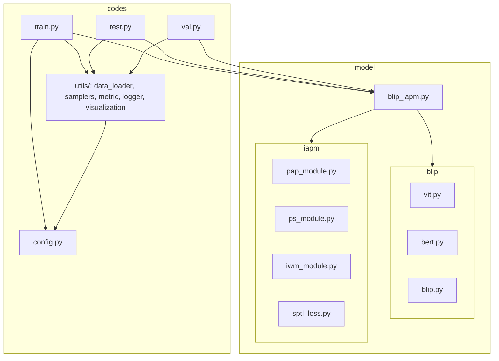

# BLIP-IAPM-ReID 流程图集合（Mermaid）

本文档使用 Mermaid 语法给出项目的核心流程图，便于快速理解整体数据流、前向计算、训练循环与评估流程。

注意：在支持 Mermaid 的渲染环境（如 GitHub、VSCode 插件或文档站点）中查看可获得图形化展示。


## 1. 系统整体数据流（高层架构）

```mermaid
flowchart TD
    A[Image: pixel_values (B,3,384,128)] --> V[ViTForReID\nfeat_map (B,768,24,8)]
    V --> PS[PSModule (train only)\nDeconv+1x1 -> seg_logits\nps_loss]
    PS --> PAP[PAP Module\n7-part horizontal pooling\npart_feats (B,7,768)]

    B[Text: input_ids/attention_mask] --> T[BertForReID\ntext_feat (B,768)\ntext_seq_feat (B,L,768)]

    PAP --> IWM[IWM Module\n2-layer MLP + softmax\npart_weights (B,7)]
    IWM --> W[Weighted part_feats\n(B,7,768)]

    W --> ATTN[Cross-Modal MultiHeadAttention]
    T --> ATTN
    ATTN --> CF[cross_feat (B,768)]
    CF --> IDH[ID Head (Linear -> logits_id)]

    subgraph Losses
      IDH --> L_id[ID Loss (CrossEntropy)]
      PS -.-> L_ps[PS Loss (CE, class-balanced)]
      PAP --> L_sptl[SPTL Loss (triplet over parts)]
      IWM --> L_sptl
      CF --> Ctr[Center Loss (MSE to class center)]
      Ctr --> Cbuf[EMA Class Centers / Counts]
    end

    L_id --> SUM[Total Loss]
    L_ps --> SUM
    L_sptl --> SUM
    Ctr --> SUM
```


## 2. 模型前向细节（跨模态注意力）

```mermaid
flowchart LR
    PF[part_feats (B,7,768)] --> IWM[IWM -> part_weights (B,7)]
    IWM --> MUL[weighted_part_feats = part_feats * weights]
    TS[text_seq_feat (B,L,768)] --> ATTN[MultiHeadAttention\nembed=768, heads=8]
    MUL --> ATTN
    ATTN --> CF[cross_feat = mean(attn_out)\n(B,768)]
    CF --> LOGITS[ID Head -> logits_id]
```


## 3. 数据管线（ReIDDataset / DataLoader / Sampler）

```mermaid
flowchart LR
    FS[(FileSystem)] -->|img_dir| DS[ReIDDataset]
    FS -->|captions.json| DS
    FS -->|pseudo_labels/| DS
    DS --> PROC[BlipProcessor\nAutoImageProcessor + AutoTokenizer]
    PROC --> IMG[pixel_values (B,3,384,128)]
    PROC --> TXT[input_ids / attention_mask]
    DS --> DL[torch DataLoader]
    SAM[RandomIdentitySampler\n(optional)] --> DL
    DL --> BATCH[Batch dict {image, text_ids, mask, label, pseudo_label, camid, img_path}]
```


## 4. 训练迭代时序图

```mermaid
sequenceDiagram
    participant DL as DataLoader
    participant M as BlipIAPMReID
    participant L as Losses (ID/PS/SPTL/Center)
    participant Opt as Optimizer
    participant Sch as LR Scheduler
    participant Log as Logger

    DL->>M: batch {image, text_input_ids, text_attention_mask, label, pseudo_label}
    M-->>DL: logits_id, part_weights, part_feats, cross_feat, losses(ps)
    Note over M,L: compute SPTL(part_feats, weights) + Center(cross_feat)

    Opt->>M: zero_grad()
    M->>Opt: backward(total_loss)
    Opt->>M: step()
    Sch->>M: step()
    Log->>Log: add_scalar (losses, rank1/mAP when eval)
    M->>M: periodic evaluate_reid() and save best checkpoint
```


## 5. 验证/评估流程

```mermaid
flowchart TD
    D[Val/Query images] --> M[Model (eval)]
    M --> F[cross_feat (B,768)]
    F --> DM[compute_distance_matrix\n(cosine/euclidean)]
    DM --> ER[evaluate_rank\nRank-1 & mAP]
```


## 6. 损失组合与系数

```mermaid
flowchart LR
    ID[ID CE Loss]
    PS[PS CE Loss]
    SPTL[SPTL Triplet Loss (alpha=1.2)]
    CTR[Center Loss (beta=5e-4)]
    ID --> SUM[Total Loss]
    PS --> SUM
    SPTL --> SUM
    CTR --> SUM
    SUM -->|L = ID + PS + λ·SPTL + β·Center| OUT[Backward/Step]
```


## 7. 目录/模块关系（简要）


